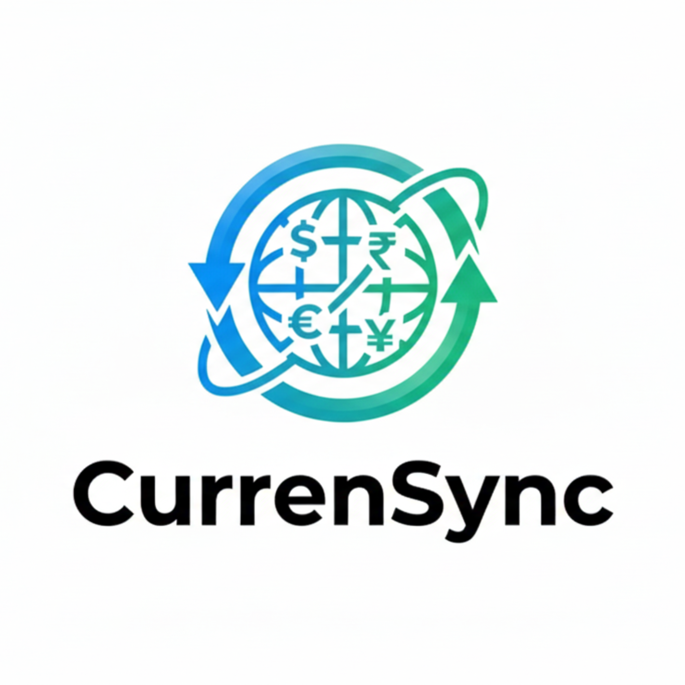

# CurrenSync - Real-time Currency Converter



A beautifully designed Flutter mobile application that provides **real-time currency conversion** with live exchange rates, transaction history tracking, and an intuitive user interface.

## Features

- ✨ **Real-time Currency Conversion** - Get live exchange rates for 170+ currencies
- 📊 **Rate Charts** - Visualize currency trends with interactive charts using FL Charts
- 🌍 **Multiple Currency Support** - Convert between popular and rare currencies
- 💾 **Conversion History** - Track all your conversions with timestamps
- 🌓 **Dark & Light Themes** - Beautiful UI that adapts to your system preference
- 🔄 **Offline Support** - Last known rates available without internet
- 🎯 **Fast & Responsive** - Smooth animations and instant conversions
- 📱 **Cross-Platform** - Works on iOS, Android, Web, and Desktop

## Screenshots

<div align="center">
  
</div>

## Project Structure

```
CurrenSync/
├── lib/
│   ├── main.dart                 # App entry point with splash screen
│   ├── models/
│   │   └── currency.dart         # Currency data model
│   ├── providers/
│   │   ├── currency_provider.dart    # State management for currencies
│   │   └── theme_provider.dart       # Dark/Light theme management
│   ├── screens/
│   │   ├── home_screen.dart         # Main conversion screen
│   │   ├── all_rates_screen.dart    # View all exchange rates
│   │   ├── currency_picker_screen.dart  # Select currencies
│   │   └── history_screen.dart      # View conversion history
│   └── services/
│       └── exchange_rate_service.dart  # API calls for rates
├── assets/
│   └── images/                   # App logos and icons
├── pubspec.yaml                  # Project dependencies
└── README.md                      # This file
```

## Getting Started

### Prerequisites

- Flutter SDK: ^3.10.4
- Dart: ^3.10.4
- Android SDK or Xcode (for iOS)

### Installation

1. **Clone the repository:**
   ```bash
   git clone https://github.com/yourusername/CurrenSync.git
   cd CurrenSync
   ```

2. **Install dependencies:**
   ```bash
   flutter pub get
   ```

3. **Set up environment variables:**
   Create a `.env` file in the project root:
   ```
   API_KEY=your_exchange_rate_api_key
   API_BASE_URL=https://api.exchangerate.com
   ```

4. **Run the app:**
   ```bash
   flutter run
   ```

## Dependencies

| Package | Version | Purpose |
|---------|---------|---------|
| `provider` | ^6.1.5+1 | State management |
| `http` | ^1.6.0 | API requests |
| `shared_preferences` | ^2.5.4 | Local storage |
| `google_fonts` | ^8.0.2 | Beautiful typography |
| `fl_chart` | ^1.1.1 | Chart visualizations |
| `intl` | ^0.20.2 | Date/time formatting |
| `flutter_dotenv` | ^6.0.0 | Environment variables |
| `connectivity_plus` | ^7.0.0 | Network detection |
| `flutter_animate` | ^4.5.2 | Smooth animations |
| `shimmer` | ^3.0.0 | Loading effects |

## Architecture

This project uses **Provider pattern** for state management:

- **`ThemeProvider`** - Manages dark/light theme persistence
- **`CurrencyProvider`** - Handles currency data, conversions, and history
- **`ExchangeRateService`** - Fetches real-time rates from external API

### Data Flow

```
UI (Screens) 
    ↓
Provider (State Management)
    ↓
Service Layer (API Calls)
    ↓
External API (Exchange Rates)
```

## Usage

### Converting Currency

1. Open the app and view the home screen
2. Select "From" and "To" currencies
3. Enter the amount to convert
4. View the instant conversion result
5. See the conversion history at the bottom

### Viewing Exchange Rates

- Tap "All Rates" to view all available currency rates
- Use the search to find specific currencies
- Toggle between popular and all currencies

### Theme Toggle

- Tap the theme icon in the app bar to switch between light and dark modes
- Theme preference is saved locally

## Project Features Deep Dive

### 🎨 Professional UI/UX
- Custom splash screen with smooth animations
- Gradient backgrounds for visual depth
- Responsive layout for all screen sizes
- Accessibility-first design

### 🔐 Data Persistence
- Local storage of conversion history using SharedPreferences
- Theme preference persistence
- Offline access to last known rates

### 📡 Network Handling
- Real-time API integration for live rates
- Network connectivity detection
- Graceful error handling and fallbacks

### ⚡ Performance
- Optimized state management to prevent unnecessary rebuilds
- Efficient data caching
- Smooth 60fps animations

## API Integration

The app fetches exchange rates from a free/premium exchange rate API. To use your own API:

1. Get an API key from your provider
2. Update the `.env` file with your API credentials
3. Modify `exchange_rate_service.dart` if needed

## Building for Production

### Android
```bash
flutter build apk --release
flutter build appbundle --release
```

### iOS
```bash
flutter build ios --release
```

### Web
```bash
flutter build web --release
```

## Troubleshooting

### No Internet Connection
- The app shows "Last Known Rates" if offline
- Conversion history remains accessible

### API Rate Limiting
- Check your API provider's rate limit
- Consider caching more aggressive

### Theme Not Persisting
- Clear app data and rebuild
- Check SharedPreferences permissions

## Contributing

Contributions are welcome! Please follow these steps:

1. Fork the repository
2. Create a feature branch (`git checkout -b feature/amazing-feature`)
3. Commit your changes (`git commit -m 'Add amazing feature'`)
4. Push to the branch (`git push origin feature/amazing-feature`)
5. Open a Pull Request

## Future Enhancements

- [ ] Cryptocurrency support
- [ ] Recurring conversions
- [ ] Push notifications for rate alerts
- [ ] Widget support
- [ ] Multi-language support (i18n)
- [ ] Cloud sync for history
- [ ] Rate comparison charts

## License

This project is licensed under the MIT License - see the [LICENSE](LICENSE) file for details.

## Acknowledgments

- **Flutter Team** - Amazing framework and documentation
- **Exchange Rate API** - Real-time currency data
- **Design Inspiration** - Modern fintech applications
- **Community** - Feedback and contributions

**Made with ❤️ using Flutter**

### Version History

- **v1.0.0** (Current) - Initial Release
  - Real-time currency conversion
  - Theme support
  - Conversion history
  - Exchange rates dashboard

---

For more information and updates, visit the [project repository](https://github.com/yourusername/CurrenSync).
